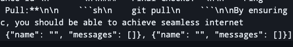

# Chatter

## Description

Chatter is based on the streamlit example, but with the added benefit of saving the chats in `JSON` format to the `~/Documents` directory which is automatically synced in `iCloud` which allows for sharing chats between Apple devices that share the same `iCloud`.

Another feature is the ability to create and save multiple chats, instead of one long running chat.  This is more similar to the actual ChatGPT interface.

This project saves money as it takes a lot of prompting to use $20 of credits each month, this project is currently using $5 / month with full time use on two computers.

OpenAI model can easily be changed in `app.py` under `OPENAI_MODEL` global.

Finally, included is `chatter.rb` and `reinstall.sh` which is a brew formula for installing this project as a brew service, and a handy script to install/reinstall the project when the source code changes.
This allows for the app to be started upon login automatically.

## How to Use

The `chatter.rb` file contains the brew formula to install with Homebrew.  It will give errors but it doesn't affect the functioning.  To install or reinstall, run `./reinstall.sh` and it should install or reinstall the app.
It is a `streamlit` app and runs in the browser.

***BONUS*** If you run Safari, you can choose `File -> Add to Dock...` and it will make the website show up as an Application.
The `chatter.rb` file includes code that makes it start as a brew service on computer start, so the app is always running in the background.  You can then call it by using `Alfred` or another quick method.

## Troubleshooting

### DuplicateWidgetID

This error happens when chatter has two blank chats in a row, possibly from starting and shutting down quickly without entering any data in the chat name or messages.  You will get the following error:

To fix this error, open up `~/Documents/chatter/chat_history.json` and inspect:

> [!WARNING]  
> Make sure `Chatter` is not running.

Delete the empty messages and close the file.  
Restart `Chatter`
